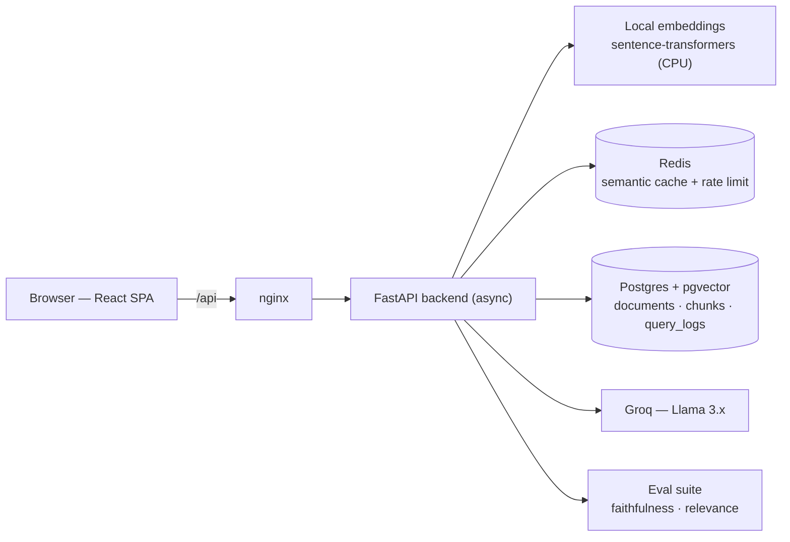
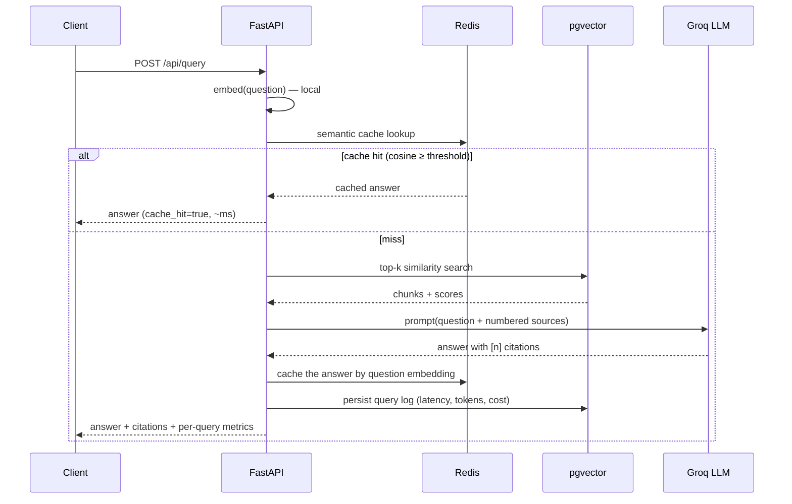

# DocVault — RAG with citations, semantic cache & observability

> A Retrieval-Augmented Generation platform over your documents, built like a
> production system — not a demo. Upload a PDF, ask questions, and get answers
> **grounded in cited sources**, while the system **caches semantically similar
> questions**, **rate-limits** abuse, **measures its own answer quality**, and
> exposes **cost/latency observability**.

The differentiator isn't "chat with a PDF" — it's the engineering *around* the
RAG: the layer that separates a tutorial from a real service.

<!-- TODO: drop a screenshot/GIF of the chat + dashboard here — it's the first thing reviewers see.
      -->

<!-- TODO: add the live link once deployed -->
**Live demo:** _coming soon_ · **API docs:** `/docs` (Swagger UI)

[](https://github.com/<your-username>/docvault/actions/workflows/ci.yml)


---

## What makes it different

| Capability | Why it matters |
|---|---|
| **Citations on every answer** | Each answer maps `[n]` markers back to the exact document, page and chunk. No source = a hallucination waiting to happen. |
| **Automatic quality evaluation** | A custom suite scores **faithfulness**, **answer relevance** and **context relevance**. *Measuring* your AI system's quality is rare in a junior portfolio. |
| **Semantic cache** | Repeated *paraphrases* hit the cache (embedding similarity), skipping the LLM entirely — real cost & latency savings, made visible on the dashboard. |
| **Observability built-in** | Every query is logged with latency, tokens, estimated cost and cache hit/miss; `/metrics` aggregates p50/p95/p99, cost and score distributions. |
| **Rate limiting** | Redis-backed limits protect the expensive LLM endpoint and return proper `429`s. |

---

## Architecture



### Request flow for a query



---

## Tech stack

- **Backend:** FastAPI (async), Python 3.12, SQLAlchemy 2 (async) + asyncpg
- **Vector store:** PostgreSQL + **pgvector** (HNSW, cosine)
- **LLM orchestration:** LangChain (`ChatGroq` + recursive text splitter)
- **LLM:** Groq (Llama 3.x) — fast & cheap open models
- **Embeddings:** `sentence-transformers` running locally on CPU (no API cost)
- **Cache & rate limiting:** Redis (semantic cache + `slowapi`)
- **Observability:** `structlog` JSON logs + a `/metrics` aggregation endpoint
- **Frontend:** React + Vite + TypeScript + Recharts
- **Infra:** Docker, docker-compose, GitHub Actions CI

---

## Quickstart (Docker — everything at once)

```bash
# 1. configure
cp .env.example .env
#    then edit .env and set GROQ_API_KEY  (free key: https://console.groq.com/keys)

# 2. up
docker compose up --build
```

- Frontend → http://localhost:3000
- API + Swagger docs → http://localhost:8000/docs

The first backend build pre-downloads the embedding model so the first question
isn't a cold start. Postgres and Redis come up with health checks; the backend
waits for them.

### Try it from the CLI

```bash
# upload a document (the included sample handbook works great)
curl -F "file=@backend/app/eval/data/sample_doc.md" http://localhost:8000/api/documents

# ask a question
curl -X POST http://localhost:8000/api/query \
  -H "Content-Type: application/json" \
  -d '{"question": "How many vacation days do employees get?"}'
```

---

## Local development (without Docker for the app)

You still need Postgres + Redis — the simplest way is to run just those via compose:

```bash
docker compose up -d postgres redis
```

**Backend** (uses [uv](https://github.com/astral-sh/uv)):

```bash
cd backend
uv sync --extra dev
uv run uvicorn app.main:app --reload   # http://localhost:8000
```

**Frontend:**

```bash
cd frontend
npm install
npm run dev                            # http://localhost:5173 (proxies /api → :8000)
```

---

## Evaluating answer quality

The eval suite indexes a gold document, runs every question through the real
pipeline (cache disabled), and scores the answers — writing the scores back so
they also appear on the dashboard.

```bash
cd backend
uv run python scripts/run_eval.py
```

It prints a summary and writes `backend/eval_report.json`:

```
============================================================
  DocVault — RAG evaluation report
============================================================
  faithfulness       : <score>
  answer_relevance   : <score>
  context_relevance  : <score>
  answer_correctness : <score>  (answerable only)
============================================================
```

> **Metrics to publish here** (run the suite with your key and paste real
> numbers — reviewers love concrete figures):
>
> | Metric | Value |
> |---|---|
> | Faithfulness (avg) | _fill in_ |
> | Answer relevance (avg) | _fill in_ |
> | Context relevance (avg) | _fill in_ |
> | Cache hit rate (after warmup) | _fill in_ |
> | Latency p95 (uncached / cached) | _fill in_ |
> | Est. cost per query | _fill in_ |

---

## Engineering decisions (the *why*)

**pgvector instead of a dedicated vector DB.** Postgres is already in nearly
every stack. Keeping chunk text, metadata and embeddings in one transactional
store means fewer moving parts to operate and reason about. It's a maturity
signal: get the most out of the boring, reliable tool before adding a new
service. The ANN index is **HNSW** with `vector_cosine_ops` — great
recall/latency and, unlike IVFFlat, no `lists` tuning or training step.

**Local embeddings (sentence-transformers).** Indexing generates a lot of
embeddings; doing them on-CPU means **zero per-token embedding cost** and no
document data leaving the box for indexing. The trade-off — slower than a hosted
API and a heavier image — is acceptable for this workload and is a deliberate
cost decision. The model is swappable via `EMBEDDING_MODEL`.

**Semantic cache, not just key/value.** A plain cache only helps on identical
strings. We embed each question and compare (cosine) against cached questions;
above a threshold we return the stored answer and **skip the LLM**. The LLM is
the slow, costly step, so every hit is a real saving — surfaced as a hit-rate on
the dashboard. (MVP scores similarity in-process over a bounded TTL'd set;
scaling it to Redis vector search / pgvector is noted below.)

**Custom eval over RAGAS.** Hand-rolled metrics give full control of the judge
prompts, far lighter dependencies, transparent scores I can explain, and no
second LLM-config surface. Faithfulness and answer-relevance use a small, cheap
Groq model as judge; context-relevance is a deterministic embedding similarity.

**Chunking with overlap on semantic boundaries.** `RecursiveCharacterTextSplitter`
prefers paragraph→line→sentence boundaries, so chunks aren't blind fixed-width
cuts. `chunk_size=1000` chars (~200–250 tokens) keeps chunks topically focused;
`chunk_overlap=150` (~15%) keeps facts that straddle a boundary retrievable.
`add_start_index` gives the offsets that power **citations**.

**Background indexing.** Upload returns immediately with a `pending` document;
extraction → chunk → embed → store runs in a FastAPI `BackgroundTask`. No broker
to operate for an MVP, and the clean one-function seam makes swapping in Celery/
arq later a localized change.

**Async everywhere.** LLM and DB calls are I/O-bound; the app is async end to end
(asyncpg, async SQLAlchemy, async Redis). The CPU-bound embedding call is pushed
to a worker thread so it never blocks the event loop.

---

## API overview

| Method | Path | Description |
|---|---|---|
| `POST` | `/api/documents` | Upload a PDF/TXT/MD; indexes in the background |
| `GET` | `/api/documents` | List documents + indexing status |
| `GET` | `/api/documents/{id}` | One document |
| `DELETE` | `/api/documents/{id}` | Delete a document (chunks cascade) |
| `POST` | `/api/query` | Ask a question → grounded answer + citations (rate-limited) |
| `GET` | `/api/metrics` | Aggregated latency / cost / cache / quality metrics |
| `GET` | `/health`, `/ready` | Liveness / readiness probes |

Full interactive docs at `/docs`.

---

## Testing & CI

```bash
cd backend
uv run ruff check app tests       # lint
uv run pytest                     # unit tests (integration auto-skips w/o a DB)
```

GitHub Actions (`.github/workflows/ci.yml`) on every push/PR:

- **backend** — ruff + pytest against real Postgres (pgvector) and Redis service
  containers; the integration test runs the full pipeline with the LLM mocked.
- **frontend** — `tsc` typecheck + production build.
- **compose** — validates `docker-compose.yml`.

---

## Project structure

```
docvault/
├── backend/
│   ├── app/
│   │   ├── api/         # routers: documents, query, metrics, health
│   │   ├── core/        # settings, structured logging, rate limiting
│   │   ├── services/    # extraction, chunking, embeddings, vector store,
│   │   │                #   llm, prompts, citations, rag, semantic cache, analytics
│   │   ├── db/          # async engine, models (Document/Chunk/QueryLog), init
│   │   ├── eval/        # custom RAG metrics + gold dataset + runner
│   │   ├── schemas/     # Pydantic request/response models
│   │   └── main.py      # FastAPI app + lifespan
│   ├── scripts/run_eval.py
│   ├── tests/
│   └── Dockerfile
├── frontend/            # React + Vite (upload · chat w/ citations · dashboard)
├── docker-compose.yml
├── render.yaml          # Render deploy blueprint
├── .github/workflows/ci.yml
└── ROADMAP.md           # the original 3-phase plan
```

---

## Deployment

- **Backend + Postgres + Redis:** `render.yaml` is a ready Blueprint for
  [Render](https://render.com) (managed Postgres supports pgvector; the app runs
  `CREATE EXTENSION` on startup). Railway / Fly.io work equally well — they all
  provide persistent Postgres + Redis, which is why the backend lives there
  rather than on Vercel.
- **Frontend:** deploy the `frontend/` build to Vercel and set
  `VITE_API_BASE` to the backend URL (and add that origin to `CORS_ORIGINS` on
  the backend).

---

## Roadmap / future work

- **Re-ranking** (cross-encoder) between vector search and the LLM
- **Hybrid search** (vector + BM25 keyword)
- **Continuous evaluation** in CI — fail the build if quality regresses
- **Streaming** responses (SSE) for better UX
- **Multi-tenancy** with auth (documents isolated per user)
- **Scale the semantic cache** to Redis vector search (RediSearch HNSW)
- **Alembic** migrations once the schema starts evolving

See [`ROADMAP.md`](ROADMAP.md) for the full original plan.

---

## License

MIT — see [`LICENSE`](LICENSE).
